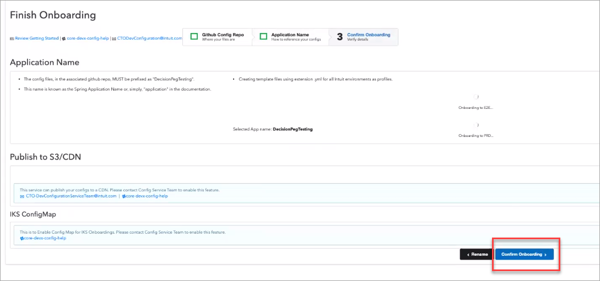

# How to onboard your service to Pegasus

Before you can start using the Pegasus Platform for decision making purposes, you must create and onboard your service on the Pegasus Platform so that you can consume the Detect and Prevent Services.

* Create a new service and onboard to pegasus
* Onboard an existing service to pegasus

**Prerequisite**: 

* Create a service to use the Decision Engine. The service would be a Springboot application for validating your data against the business rules.
* Onboard your service to the configuration service.

## Create a New Service and Onboard to Pegasus
Perform the following steps to onboard and connect your service to Pegasus:

1. Creating a New Service
2. Onboarding your service to Pegasus

### Creating a New Service
1. Login to the Intuit Development Portal and click **Create**. 
2. Then click **Create** under Services.  

3. Provide inputs for the following fields:

    1. **Name** and **Description** for your service
    2. From the Project drop-down, select **INTUIT RISK**
    3. From the City Map Capability drop-down, select **Security Risk & Fraud** > **Risk & Fraud Management** > **Decision Engine** 
    
    4. Select the appropriate BU/PD team
    5. From the JIRA drop-down, select **PDE - Smart Pegasus Decision Engine**

4. On the next screen: 

    1. From the Function(s) down-down, select **REST Provider**
    2. Select the Type of Service Template as **Java Spring MVC Service**
    3. Select the appropriate Kubernetes Cluster for Service Hosting for the BU/PD Team select on the previous screen.
    4. Select the appropriate region to create the namespace.
5. Click **Create**.
Your Service gets created.
6.	Click **View Service** to view the service details. 

### Onboarding a Service
1. Go to the **Pegasus** tab > Additional Configuration, and select the environment to onboard your service.
2. Click **Connect*8 beside Rules Artifact Manager.
Contact the Pegasus support team on Slack (#pegasus-decision-engine-help) if you face any issues while onboarding the Rules Artifacts.

3. Click **Connect**.

4. Select **INTUIT RISK**. 

5. Search for the service, and then click **SELECT** for the service you want to connect to. 

6. Connect the **QA**, **E2E**, and **PERF** services. 

7. Specify the location of the E2E Git repository. You’ll get the Git Repository URL from the **Overview** section.
 
8. Specify an **Application name**, select the format of the template config files, and then click **Review**. 

9. Review the information and click **Confirm Onboarding**. 

Once the onboarding is done, you’ll see the checkboxes selected for the respective services under Application Name.
10.	Click **Onboarding Done! See Details**.
11.	Go to the **Pegasus** tab, and refresh the page. You’ll see that the Rules Artifact Manager is now connected. 
12.	Once the Rules Artifact Manager is connected, click **Connect**. 

13.	You’ll see three GitHub repositories: Service, Config, and Development. Pegasus creates the repositories for you.
 
14.	Select the POM file and click **Next**. Pegasus requires this information to create a pull request on the GitHub repositories with the configuration required to enable the Rules Engine. 

15.	Once you click Next, you’ll see the three Pull Requests: One each on the three repositories see in Step 21. 

16.	Merge the three Pull Requests. 
